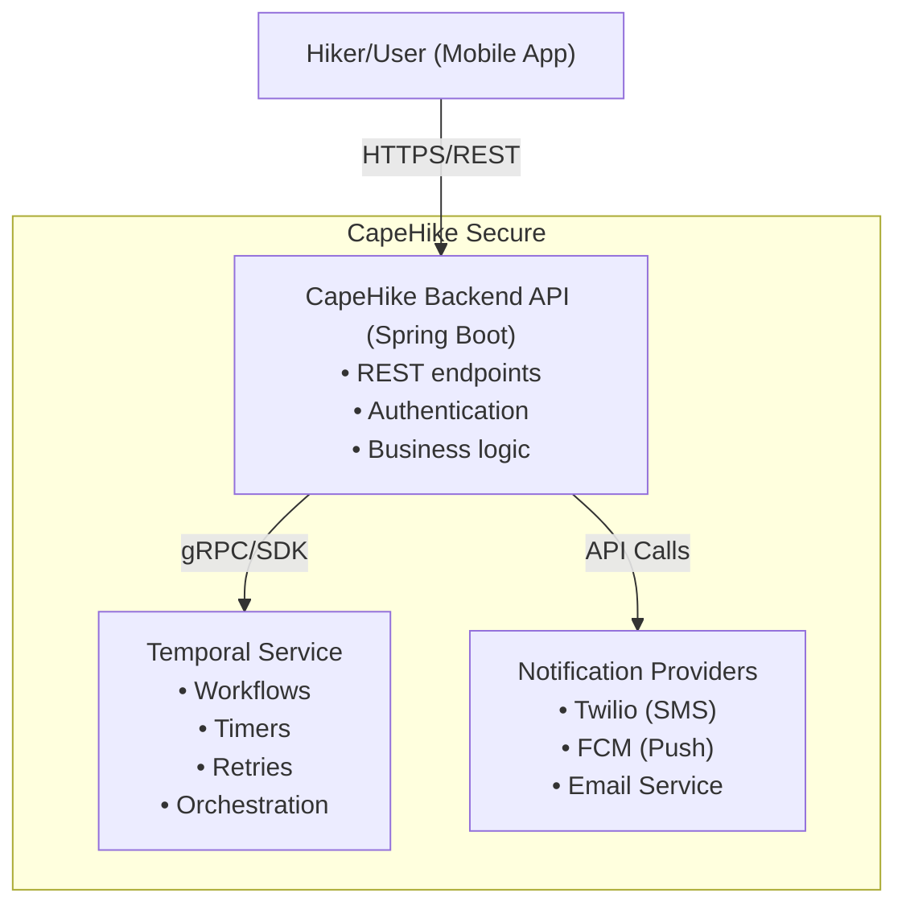
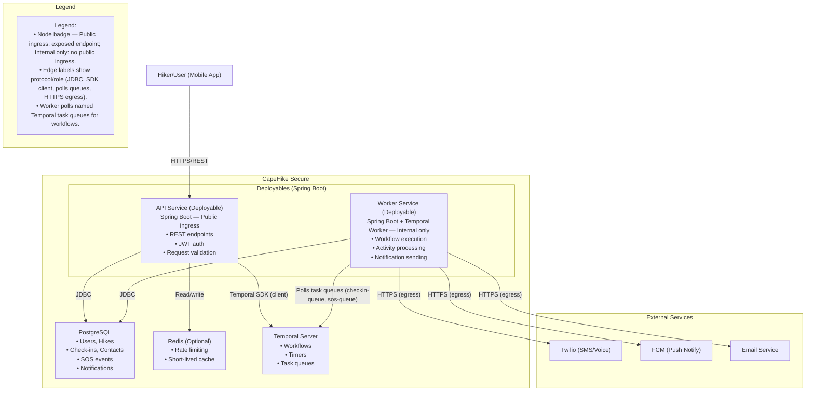
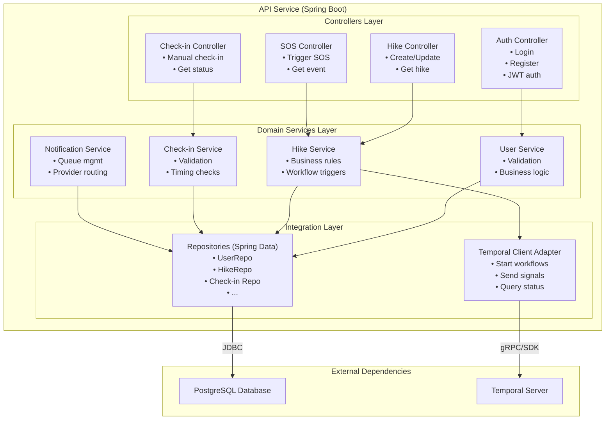
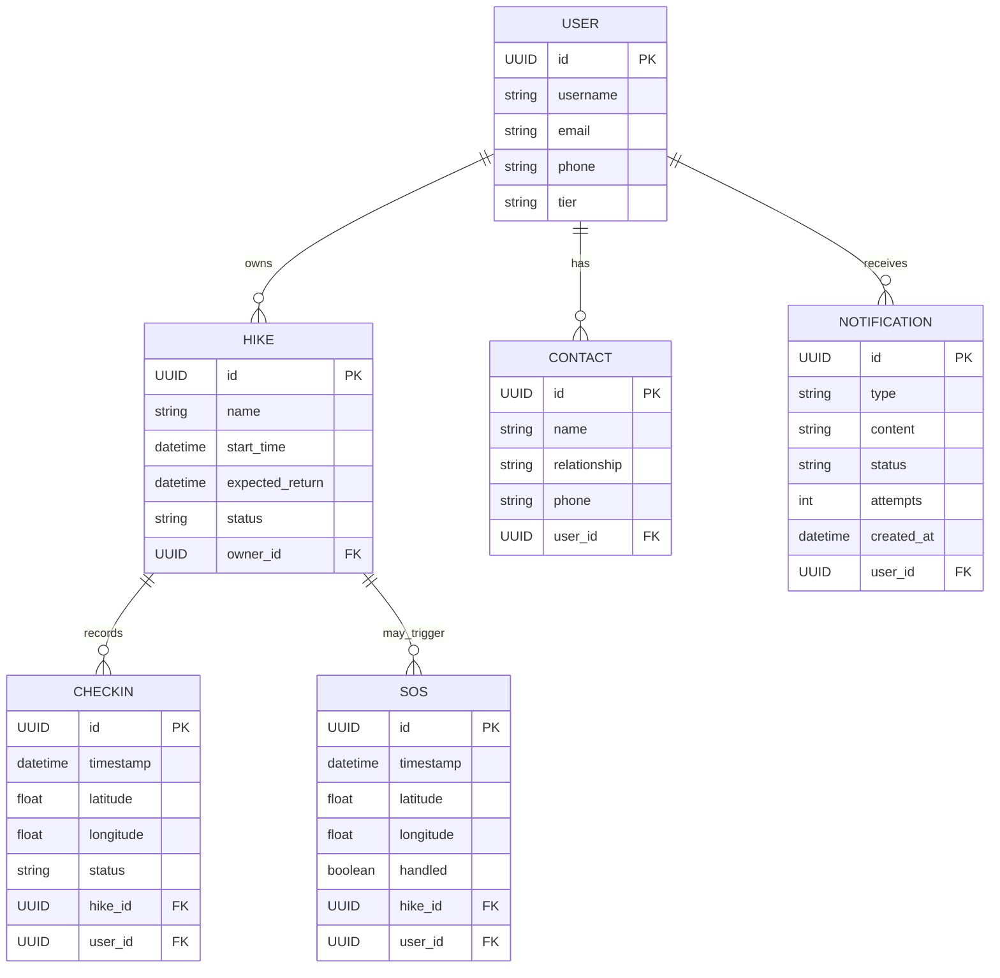

# hike

CapeHike Secure — Backend Architecture (Spring Boot + Temporal)

Status: Architectural draft for the backend. Contains architectural diagrams for system context, containers, and major components, plus domain model and Temporal workflow mappings. This README is intended to live in the repo root and guide implementation.

---

## Table of Contents
- [1. Purpose & Vision](#1-purpose--vision)
- [2. Key Decisions (Executive Summary)](#2-key-decisions-executive-summary)
- [3. Core Domain (Short)](#3-core-domain-short)
- [4. Architectural Diagrams](#4-architectural-diagrams)
  - [4.1 System Context (C4 - Level 1)](#41-system-context-c4---level-1)
  - [4.2 Container Diagram (C4 - Level 2)](#42-container-diagram-c4---level-2)
  - [4.3 Component Diagram (C4 - Level 3) — API Service](#43-component-diagram-c4---level-3--api-service)
- [5. Domain Model](#5-domain-model)
  - [Entity Relationships](#entity-relationships)
- [6. Temporal Workflows Mapping](#6-temporal-workflows-mapping)
  - [Why Temporal?](#why-temporal)
- [7. APIs (High-Level)](#7-apis-high-level)
- [8. Infrastructure & Deployment (Recommended)](#8-infrastructure--deployment-recommended)
- [9. Operational Considerations](#9-operational-considerations)
- [10. Next Steps — Implementation Roadmap](#10-next-steps--implementation-roadmap)

---

## 1. Purpose & Vision

We are building the CapeHike Secure backend using Spring Boot (Java) and Temporal.io for durable workflows and background orchestration. The goal is a pragmatic, maintainable architecture that supports fast iteration for the MVP (SOS, scheduled check-ins, simple location updates) while remaining extensible for premium features (offline maps, advanced routing, group tracking).

This document provides:
- A concise domain summary and core entities.
- Architectural diagrams for system, containers, and components.
- How Temporal workflows map to domain operations.
- Infrastructure and deployment recommendations.
- Implementation next steps and a checklist.

---

## 2. Key Decisions (Executive Summary)
- Spring Boot for REST API, security, persistence, and service-level components — reliable, familiar, enterprise-grade.
- Temporal.io for orchestrating long-running processes (scheduled check-ins, SOS escalation, retryable notifications) to avoid fragile cron jobs and brittle scheduling logic.
- PostgreSQL for the primary relational data store (users, hikes, contacts, subscriptions, events).
- Redis (optional) for short-lived caches and rate limiting.
- Twilio (or local SMS provider) and email for notifications; push notifications via FCM/APNs.
- Design for stateless API nodes; push state into the database or Temporal workflows.

---

## 3. Core Domain (Short)
- User — identity, preferences, subscription tier.
- Hike — planned route metadata, expected return time, created_by.
- Participant / Contact — emergency contacts / watchers.
- Check-in — timestamped confirmation, GPS position, status.
- SOS — emergency event triggered by a user (or automatically by workflow).
- Notification — queued notification attempts and statuses.
- WorkflowInstance — Temporal workflow metadata (not required to persist fully, but helpful for troubleshooting).

---

## 4. Architectural Diagrams

These diagrams follow C4 concepts: System Context (L1), Containers (L2), Components (L3).

### 4.1 System Context (C4 - Level 1)

### 4.2 Container Diagram (C4 - Level 2)

### 4.3 Component Diagram (C4 - Level 3) — API Service

---

## 5. Domain Model

### Entity Relationships

---

## 6. Temporal Workflows Mapping

### Why Temporal?

Temporal gives us durable, observable, and retryable orchestration primitives. For the CapeHike MVP this maps to:

- Scheduled Check-in Workflow:
  - Starts when a user creates a hike with an expected return time.
  - A timer waits until return_time + grace_period; on timer expiry, it checks the latest check-in.
  - If missing or late, escalate: send push/SMS. If there is no response, escalate to emergency contacts and optionally call external services.

- SOS Workflow:
  - Triggered immediately on SOS request.
  - Runs parallel activities: record event, notify the primary contact, escalate to emergency contacts, and optionally create an incident in third-party rescue systems.
  - Uses retries with exponential backoff for notification attempts.

- Notification Retry Activity:
  - Attempts delivery via the preferred provider and records the outcome in the database. Retries are managed by Temporal, not by custom cron jobs.

Implementation notes:
- Implement Temporal workflows and activities in a dedicated worker module (capehike-worker).
- Keep activities thin: they should call downstream services (DB, Twilio, push). Business decisions live in workflows or domain services as appropriate.
- Record key events to the database for audit and support. Avoid duplicating the domain of record inside Temporal; prefer references (IDs) in workflow signals.

---

## 7. APIs (High-Level)
- POST /api/v1/hikes — create a hike (starts the Scheduled Check-in workflow).
- GET /api/v1/hikes/{id} — get a hike.
- POST /api/v1/hikes/{id}/checkin — user check-in (signals the workflow).
- POST /api/v1/hikes/{id}/sos — trigger SOS.
- GET /api/v1/users/{id}/contacts — list contacts.
- POST /api/v1/notifications/webhook — provider callbacks (optional).

Authentication via JWT (OAuth2 can be added later when integrating partners).

---

## 8. Infrastructure & Deployment (Recommended)
- Kubernetes (EKS/GKE/AKS) or simple Docker Compose for the MVP.
- Services:
  - capehike-api (horizontal pods, autoscale).
  - capehike-worker (Temporal worker).
  - postgres (managed if possible).
  - redis (optional).
  - temporal (Temporal Cloud or self-hosted Temporal Server + dependencies).
- Observability: Prometheus, Grafana, and Jaeger (Temporal integrates with OpenTelemetry).
- CI/CD: GitHub Actions or GitLab CI building containers, pushing to a registry, and deploying via Helm/ArgoCD.

---

## 9. Operational Considerations
- Database migrations: Flyway or Liquibase.
- Secrets: Vault or a cloud-native secrets manager.
- Backups: regular Postgres backups and Temporal visibility retention policies.
- SLA: design for ephemeral worker restarts; Temporal ensures workflows resume.

---

## 10. Next Steps — Implementation Roadmap
1. Create the repo structure: capehike-api, capehike-worker, capehike-common (DTOs, models), infra (k8s / docker-compose).
2. Implement domain models and persistence (Postgres + Spring Data JPA).
3. Add auth (JWT) and basic API endpoints for Hike and Check-in.
4. Add a Temporal worker and skeletal Scheduled Check-in workflow; test against a local Temporal server.
5. Wire notifications (Twilio/FCM) as activities.
6. Add automated tests and a CI pipeline.

---
